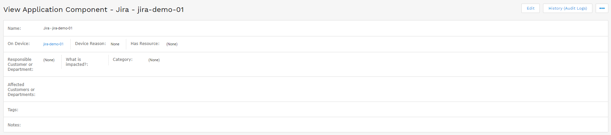
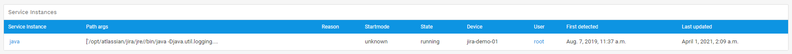
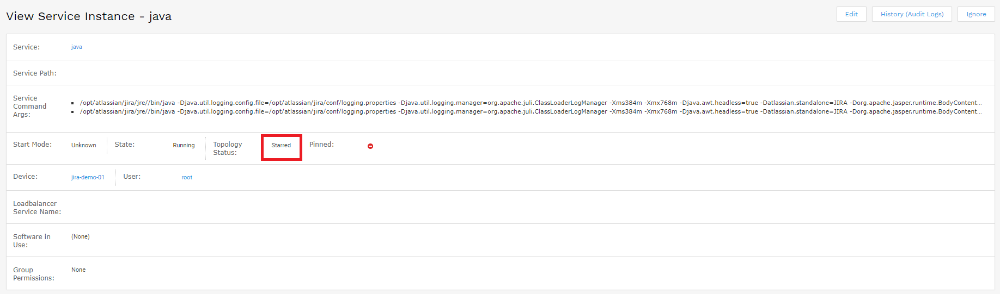

# d42-apptemplates
  - [1. Description](#1-description)
  - [2. Features](#2-features)
  - [3. Requirements](#3-requirements)
  - [4. How to Use](#4-how-to-use)
    - [4.1. cd to d42-apptemplates and Create a new virtualenv](#41-cd-to-d42-apptemplates-and-create-a-new-virtualenv)
    - [4.2. Activate the virtual environment](#42-activate-the-virtual-environment)
    - [4.3. Install requirements](#43-install-requirements)
    - [4.4. Rename config.yaml.example to config.yaml and fill out the required fields](#44-rename-configyamlexample-to-configyaml-and-fill-out-the-required-fields)
    - [4.5. Replace example templates in templates.yaml with your own](#45-replace-example-templates-in-templatesyaml-with-your-own)
    - [4.6. Run](#46-run)
    - [4.7. Schedule via cron](#47-schedule-via-cron)
  - [5. How it Works](#5-how-it-works)
    - [5.1. Example template:](#51-example-template)
  - [6. Example Output](#6-example-output)
  - [7. Example Screenshots](#7-example-screenshots)

## 1. Description
Quick way to define templates to create application components for apps that Device42 does not support out of the box and pin/star services accordingly.

## 2. Features
- Automatically pin / set topology status for service instances matching on name or cmd path args.
- Automatically create application component records on devices with associated service instances

## 3. Requirements
- Python 3.6.9 or > 
    - PyYAML==5.4.1
    - requests==2.25.1
- Device42 MA 16.22.00.1612807182 or >

## 4. How to Use
### 4.1. cd to d42-apptemplates and Create a new virtualenv 

    venv venv

OR

    python3 -m venv venv

### 4.2. Activate the virtual environment

    source venv/bin/activate

### 4.3. Install requirements

    pip install -r requirements.txt

### 4.4. Rename config.yaml.example to config.yaml and fill out the required fields

### 4.5. Replace example templates in templates.yaml with your own

### 4.6. Run 

    python starter.py

### 4.7. Schedule via cron
In crontab add a line like the following to set your command execution schedule:

    0 0 * * * python /home/your_user_here/d42-apptemplates/starter.py

This will run the script every night at midnight.

## 5. How it Works
### 5.1. Example template:

    Confluence: -- This is the name of the application component
        Services: -- Define services to query d42 for
            java: 
                Paths: -- List out paths here to compare against the Service Command Args on the service instance
                    - '/atlassian/confluence'
                topology_status: 'starred' -- Set the desired topology status {normal, starred, hidden}
                pinned: 'no' -- Set to 'yes' to pin the service instance

In the above example, the script will query Device42 and return service instances with the service display name 'java' where the service command args match any of the paths defined. It will then create application component records 'Confluence - DEVICE_NAME' and then update any associated service instances.

## 6. Example Output
Below is sample output returned from executing the script:

    **********  Posting Application Components  **********

    POST: {'device': 'docker-90214.device42.pvt', 'name': 'Docker - docker-90214.device42.pvt'}
    Response: {'msg': ['Application Component added or updated.', 2467, 'Docker - docker-90214.device42.pvt', False, False], 'code': 0}

    POST: {'device': 'VMWARE-56 4D 78 5E 40 07 11 29-8E 89 61 88 84 04 27 7B', 'name': 'Jira - VMWARE-56 4D 78 5E 40 07 11 29-8E 89 61 88 84 04 27 7B'}
    Response: {'msg': ['Application Component added or updated.', 2475, 'Jira - VMWARE-56 4D 78 5E 40 07 11 29-8E 89 61 88 84 04 27 7B', False, False], 'code': 0}

    POST: {'device': 'qa-ubujen-90-4-18', 'name': 'Docker - qa-ubujen-90-4-18'}
    Response: {'msg': ['Application Component added or updated.', 2477, 'Docker - qa-ubujen-90-4-18', False, False], 'code': 0}

    POST: {'device': 'jira-demo-01', 'name': 'Jira - jira-demo-01'}
    Response: {'msg': ['Application Component added or updated.', 2476, 'Jira - jira-demo-01', False, False], 'code': 0}

    POST: {'device': 'ubu-f5web1-3-26.device42.pvt', 'name': 'Docker - ubu-f5web1-3-26.device42.pvt'}
    Response: {'msg': ['Application Component added or updated.', 2472, 'Docker - ubu-f5web1-3-26.device42.pvt', False, False], 'code': 0}

    POST: {'device': 'jira-7-dev.device42.pvt', 'name': 'Jira - jira-7-dev.device42.pvt'}
    Response: {'msg': ['Application Component added or updated.', 2479, 'Jira - jira-7-dev.device42.pvt', False, False], 'code': 0}

    POST: {'device': 'VMWARE-56 4D 5A 4B FF 5C 1A 97-2C B3 95 16 72 23 66 7E', 'name': 'Docker - VMWARE-56 4D 5A 4B FF 5C 1A 97-2C B3 95 16 72 23 66 7E'}
    Response: {'msg': ['Application Component added or updated.', 2471, 'Docker - VMWARE-56 4D 5A 4B FF 5C 1A 97-2C B3 95 16 72 23 66 7E', False, False], 'code': 0}

    POST: {'device': 'ubuntu-0-108', 'name': 'Docker - ubuntu-0-108'}
    Response: {'msg': ['Application Component added or updated.', 2468, 'Docker - ubuntu-0-108', False, False], 'code': 0}

    POST: {'device': 'atlassian-001.device42.pvt', 'name': 'Confluence - atlassian-001.device42.pvt'}
    Response: {'msg': ['Application Component added or updated.', 2480, 'Confluence - atlassian-001.device42.pvt', False, False], 'code': 0}

    POST: {'device': 'ubu-integration-004-2-236.device42.pvt', 'name': 'Docker - ubu-integration-004-2-236.device42.pvt'}
    Response: {'msg': ['Application Component added or updated.', 2473, 'Docker - ubu-integration-004-2-236.device42.pvt', False, False], 'code': 0}

    POST: {'device': 'docker-001', 'name': 'Docker - docker-001'}
    Response: {'msg': ['Application Component added or updated.', 2474, 'Docker - docker-001', False, False], 'code': 0}

    POST: {'device': 'ip-10-24-0-76.ec2.internal', 'name': 'Jira - ip-10-24-0-76.ec2.internal'}
    Response: {'msg': ['Application Component added or updated.', 2478, 'Jira - ip-10-24-0-76.ec2.internal', False, False], 'code': 0}

    POST: {'device': 'qa-ubujen-90-4-21', 'name': 'Docker - qa-ubujen-90-4-21'}
    Response: {'msg': ['Application Component added or updated.', 2470, 'Docker - qa-ubujen-90-4-21', False, False], 'code': 0}

    POST: {'device': 'ip-172-31-30-27', 'name': 'Docker - ip-172-31-30-27'}
    Response: {'msg': ['Application Component added or updated.', 2469, 'Docker - ip-172-31-30-27', False, False], 'code': 0}

    **********  Posting Service Instances  **********

    POST: {'service_detail_id': 65266, 'pinned': 'no', 'topology_status': 'normal', 'appcomps': 'Docker - docker-90214.device42.pvt'}
    Response: {'msg': ['service_detail added/updated', 65266, 'docker-proxy', False, False], 'code': 0}

    POST: {'service_detail_id': 132432, 'pinned': 'no', 'topology_status': 'normal', 'appcomps': 'Docker - ip-172-31-30-27'}
    Response: {'msg': ['service_detail added/updated', 132432, 'docker-proxy', False, False], 'code': 0}

    POST: {'service_detail_id': 70827, 'pinned': 'no', 'topology_status': 'normal', 'appcomps': 'Docker - docker-001'}
    Response: {'msg': ['service_detail added/updated', 70827, 'docker', False, False], 'code': 0}

    POST: {'service_detail_id': 70854, 'pinned': 'no', 'topology_status': 'normal', 'appcomps': 'Docker - ubuntu-0-108'}
    Response: {'msg': ['service_detail added/updated', 70854, 'docker', False, False], 'code': 0}

    POST: {'service_detail_id': 71303, 'pinned': 'no', 'topology_status': 'normal', 'appcomps': 'Docker - qa-ubujen-90-4-21'}
    Response: {'msg': ['service_detail added/updated', 71303, 'docker', False, False], 'code': 0}

    POST: {'service_detail_id': 121913, 'pinned': 'no', 'topology_status': 'normal', 'appcomps': 'Docker - ubu-f5web1-3-26.device42.pvt'}
    Response: {'msg': ['service_detail added/updated', 121913, 'docker', False, False], 'code': 0}

    POST: {'service_detail_id': 77853, 'pinned': 'no', 'topology_status': 'normal', 'appcomps': 'Docker - qa-ubujen-90-4-18'}
    Response: {'msg': ['service_detail added/updated', 77853, 'docker', False, False], 'code': 0}

    POST: {'service_detail_id': 65201, 'pinned': 'no', 'topology_status': 'normal', 'appcomps': 'Docker - docker-90214.device42.pvt'}
    Response: {'msg': ['service_detail added/updated', 65201, 'docker', False, False], 'code': 0}

    POST: {'service_detail_id': 71261, 'pinned': 'no', 'topology_status': 'normal', 'appcomps': 'Docker - VMWARE-56 4D 5A 4B FF 5C 1A 97-2C B3 95 16 72 23 66 7E'}
    Response: {'msg': ['service_detail added/updated', 71261, 'docker', False, False], 'code': 0}

    POST: {'service_detail_id': 63549, 'pinned': 'no', 'topology_status': 'normal', 'appcomps': 'Docker - ubu-integration-004-2-236.device42.pvt'}
    Response: {'msg': ['service_detail added/updated', 63549, 'docker', False, False], 'code': 0}

    POST: {'service_detail_id': 132358, 'pinned': 'no', 'topology_status': 'normal', 'appcomps': 'Docker - ip-172-31-30-27'}
    Response: {'msg': ['service_detail added/updated', 132358, 'docker', False, False], 'code': 0}

    POST: {'service_detail_id': 65376, 'pinned': 'no', 'topology_status': 'starred', 'appcomps': 'Jira - VMWARE-56 4D 78 5E 40 07 11 29-8E 89 61 88 84 04 27 7B'}
    Response: {'msg': ['service_detail added/updated', 65376, 'java', True, False], 'code': 0}

    POST: {'service_detail_id': 63428, 'pinned': 'no', 'topology_status': 'starred', 'appcomps': 'Jira - jira-demo-01'}
    Response: {'msg': ['service_detail added/updated', 63428, 'java', True, False], 'code': 0}

    POST: {'service_detail_id': 63428, 'pinned': 'no', 'topology_status': 'starred', 'appcomps': 'Jira - jira-demo-01'}
    Response: {'msg': ['service_detail added/updated', 63428, 'java', False, False], 'code': 0}

    POST: {'service_detail_id': 128235, 'pinned': 'no', 'topology_status': 'starred', 'appcomps': 'Jira - ip-10-24-0-76.ec2.internal'}
    Response: {'msg': ['service_detail added/updated', 128235, 'java', True, False], 'code': 0}

    POST: {'service_detail_id': 78680, 'pinned': 'no', 'topology_status': 'starred', 'appcomps': 'Jira - jira-7-dev.device42.pvt'}
    Response: {'msg': ['service_detail added/updated', 78680, 'java', True, False], 'code': 0}

    POST: {'service_detail_id': 93657, 'pinned': 'no', 'topology_status': 'starred', 'appcomps': 'Confluence - atlassian-001.device42.pvt'}
    Response: {'msg': ['service_detail added/updated', 93657, 'java', True, False], 'code': 0}

## 7. Example Screenshots
Newly created application component record

Associated service instancees based on the template

Updated service instance topology status
  

